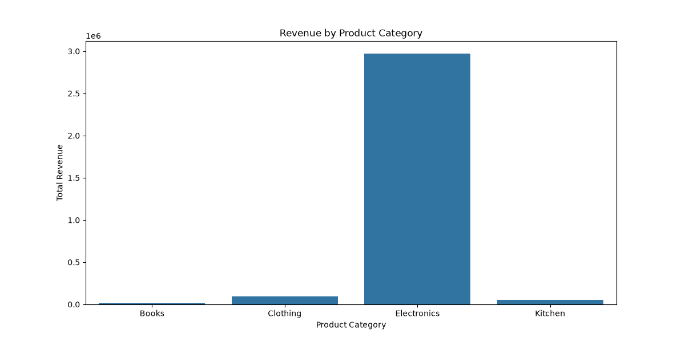
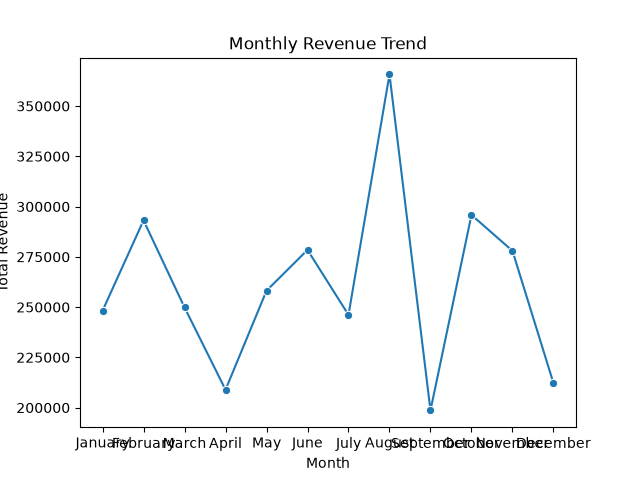
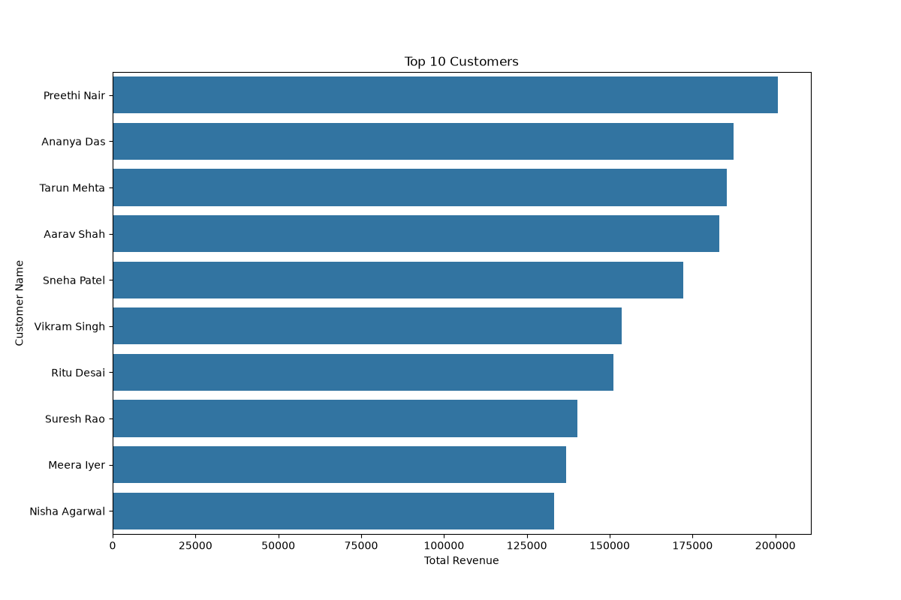

# 🛒 E-Commerce Sales Analysis — SQL + Python


## 📌 Project Overview

End-to-end SQL + Python data analysis project on an e-commerce database.
Built a complete data pipeline — from database setup to automated report
generation — analyzing 60 orders, 30 customers and 20 products across
4 product categories.

---

## 🎯 Business Problem

> *"The e-commerce company needs to understand sales performance, identify
> top customers, find best selling products, track monthly growth and
> re-engage inactive customers."*

**Business Questions Answered:**
```
BASIC:
Q1.  Total revenue, orders and customers
Q2.  Monthly revenue trend (Jan-Dec 2024)
Q3.  Top 10 customers by revenue

INTERMEDIATE:
Q4.  Revenue by product category
Q5.  Top 10 best selling products
Q6.  Average order value by customer segment
Q7.  Order count by status

ADVANCED:
Q8.  Month over month revenue growth %
Q9.  Customer lifetime value
Q10. Top 3 products per category (window functions!)
Q11. Inactive customers since July 2024
Q12. Revenue by city and state
```

---

## 📁 Project Structure

```
ecommerce-sql-report/
│
├── data/
│   ├── ecommerce_setup.sql    ← database schema + data
│   └── ecommerce.db           ← SQLite database (auto-generated)
│
├── sql/
│   └── analysis_queries.sql   ← all 12 SQL queries
│
├── src/
│   ├── database.py            ← DB connection + setup
│   ├── analysis.py            ← 11 query functions
│   └── main.py                ← entry point + charts
│
├── reports/
│   ├── total_summary.csv
│   ├── monthly_revenue.csv
│   ├── top_customers.csv
│   ├── category_revenue.csv
│   ├── top_products.csv
│   ├── average_order_value.csv
│   ├── order_count.csv
│   ├── revenue_growth.csv
│   ├── customer_value.csv
│   ├── top_categorywise_products.csv
│   ├── inactive_customers.csv
│   ├── city_revenue.csv
│   ├── revenue_by_category.png
│   ├── monthly_revenue_trend.png
│   └── top_customers.png
│
├── requirements.txt
└── README.md
```

---

## 🗄️ Database Schema

```
┌─────────────┐         ┌──────────────────────┐
│  customers  │         │        orders        │
│─────────────│         │──────────────────────│
│ customer_id │────────▶│ order_id      (PK)   │
│ name        │         │ customer_id   (FK)   │
│ email       │         │ order_date           │
│ city        │         │ status               │
│ state       │         └──────────────────────┘
│ segment     │                   │
└─────────────┘                   │
                        ┌─────────┴────────────┐
                        │     order_items      │
                        │──────────────────────│
                        │ item_id       (PK)   │
                        │ order_id      (FK)   │
                        │ product_id    (FK)   │
                        │ quantity             │
                        │ unit_price           │
                        │ discount_pct         │
                        │ revenue              │
                        └──────────────────────┘
                                  │
                        ┌─────────┴────────────┐
                        │      products        │
                        │──────────────────────│
                        │ product_id    (PK)   │
                        │ product_name         │
                        │ category             │
                        │ brand                │
                        │ cost_price           │
                        │ sell_price           │
                        └──────────────────────┘
```

**Revenue Formula:**
```sql
revenue = quantity * unit_price * (1 - discount_pct / 100.0)
```

---

## 📊 Key Findings

### 1. Total Summary
```
💰 Total Revenue  = ₹31,33,219
📦 Total Orders   = 60
👥 Total Customers = 30
```

### 2. Top Category
```
🏆 Electronics dominates revenue
   iPhone 14, MacBook Air, iPad Pro
   drive majority of sales!
```

### 3. Top Customer
```
👑 Preethi Nair = #1 customer by lifetime value
```

### 4. Monthly Trend
```
📈 August = highest revenue month
📉 January = lowest revenue month
```

### 5. Order Status
```
✅ Delivered   → majority of orders
❌ Cancelled   → 7 orders
↩️ Returned    → 5 orders
⏳ Processing  → 4 orders
```

### 6. Inactive Customers
```
⚠️ Several customers inactive since July 2024
   → Target for re-engagement campaigns!
```

---

## 💡 Business Recommendations

```
1. FOCUS ON ELECTRONICS
   → Highest revenue category by far
   → Expand Apple + Samsung product range

2. RE-ENGAGE INACTIVE CUSTOMERS
   → Customers inactive since July 2024
   → Send discount coupons to win back!

3. REWARD VIP CUSTOMERS
   → VIP segment = highest avg order value
   → Loyalty program would retain them

4. BOOST AUGUST PROMOTIONS
   → Highest revenue month
   → Double down on marketing in July-August

5. REDUCE CANCELLATIONS
   → 7 cancelled orders = lost revenue
   → Investigate reasons + improve UX
```

---

## 🛠️ Tech Stack

| Tool | Purpose |
|------|---------|
| Python 3 | Core language |
| SQLite | Database |
| Pandas | Data manipulation |
| Matplotlib | Base plotting |
| Seaborn | Statistical charts |
| sqlite3 | Python-SQLite connection |

---

## 🚀 How to Run

**1. Clone the repository:**
```bash
git clone https://github.com/harshi1006/ecommerce-sql-report.git
cd ecommerce-sql-report
```

**2. Create virtual environment:**
```bash
python3 -m venv venv
source venv/bin/activate  # Mac/Linux
venv\Scripts\activate     # Windows
```

**3. Install dependencies:**
```bash
pip install -r requirements.txt
```

**4. Run the project:**
```bash
python3 src/main.py
```

**5. Check outputs:**
```
reports/ folder → 12 CSV files + 3 charts!
```

---

## 📊 Sample Visualizations

### Revenue by Category


### Monthly Revenue Trend


### Top 10 Customers


---

## 🔑 Advanced SQL Used

```sql
-- Window Functions
RANK() OVER (PARTITION BY category ORDER BY revenue DESC)
LAG(total_revenue) OVER (ORDER BY month_num)

-- CTEs
WITH monthly_revenue AS (...)
WITH ranked_products AS (...)

-- Subqueries
JOIN (SELECT order_id, SUM(revenue) AS order_total
      FROM order_items GROUP BY order_id) oi

-- Aggregations
SUM, COUNT, AVG, ROUND, MAX
GROUP BY, HAVING, ORDER BY
```

---

## 👩‍💻 Author

**Harshii**
- 🔗 GitHub: [harshi1006](https://github.com/harshi1006)
- 💼 Role: Data Analyst | TCS
- 📍 Indore, India

---

## 📄 License

This project is open source and available under the MIT License.
